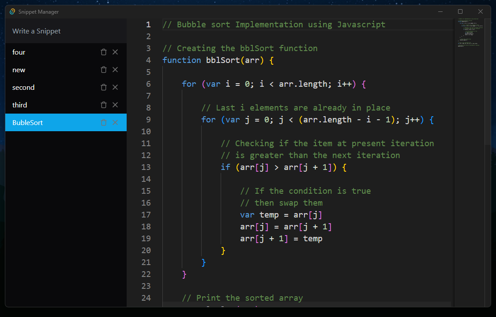

# Tauri + React + Typescript

This is a simple destkop applicationt that allow to store in files your favorite snippets. The Ui is made with React, Typescript and TailwindCSS and the backend is made with Rust and Tauri.



This template should help get you started developing with Tauri, React and Typescript in Vite.

## Recommended IDE Setup

- [VS Code](https://code.visualstudio.com/) + [Tauri](https://marketplace.visualstudio.com/items?itemName=tauri-apps.tauri-vscode) + [rust-analyzer](https://marketplace.visualstudio.com/items?itemName=rust-lang.rust-analyzer)

## Install for development

```bash
git clone https://github.com/fazt/tauri-react-app
cd tauri-react-app
npm install
npm run tauri dev
```